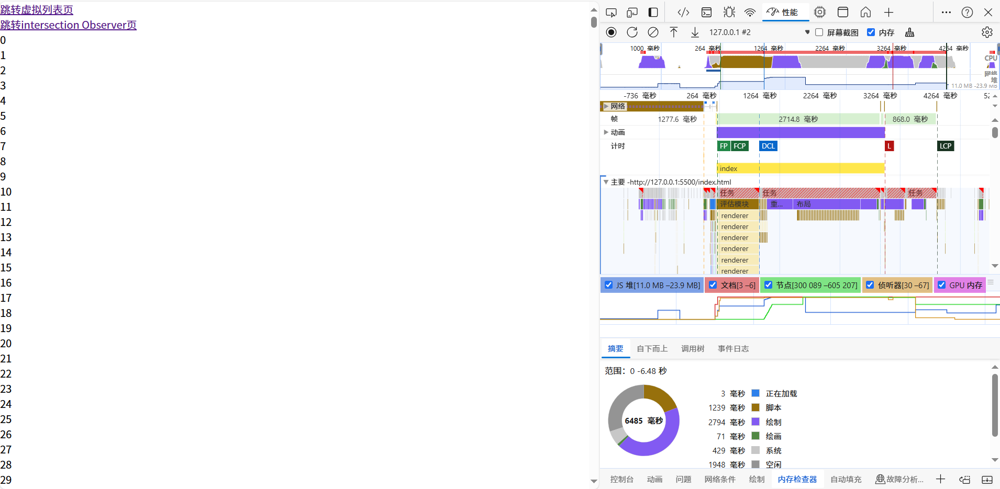
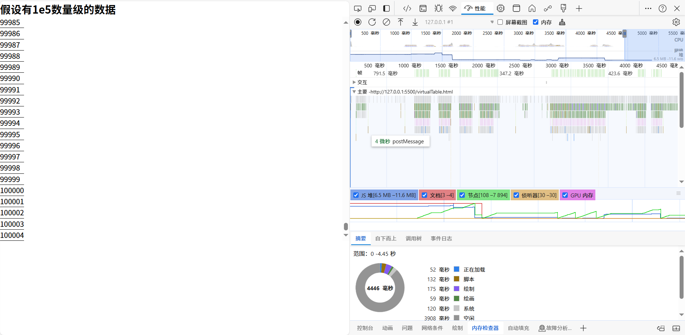
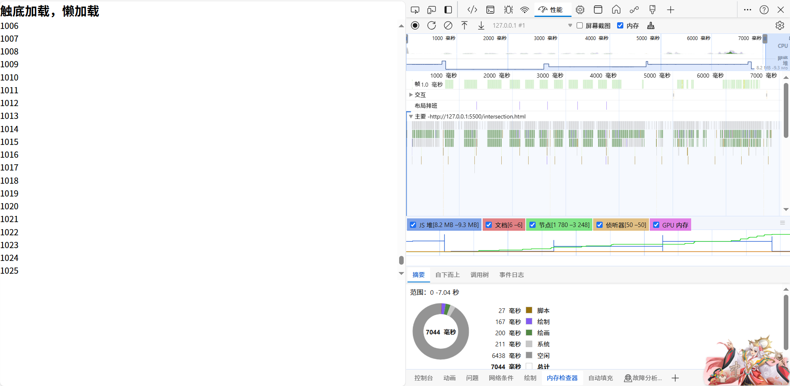

原生js实现模拟大数据量（5万多条数据）的渲染时候的性能优化：

三种方法都能感受到页面不是很卡，只是分批渲染会渲染会有很长的时间等待

分批渲染测试结果：

虚拟列表性能测试结果：

懒加载性能测试结果：

小优化：在插入渲染大量li插入到ul会频繁触发reflow，使用document.createDocumentFragment来减少reflow的次数

[演示网址： https://yirenlove.github.io/bigDataRender/]( https://yirenlove.github.io/bigDataRender/)
